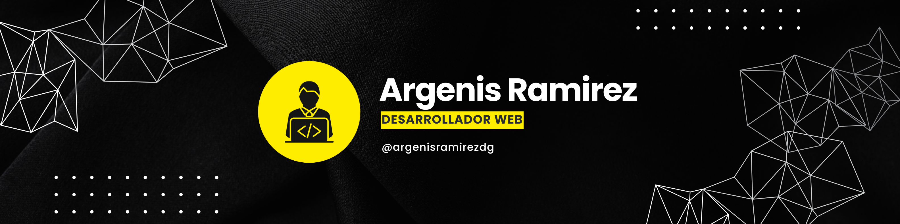

#   ¡Hola! Encantado de tenerte aquí.

### ¡Bienvenido a mi perfil de GitHub!👋🏼
Te saluda Argenis Ramírez, Desarrollador Web Front-End ubicado en <strong>Zulia, Venezuela.</strong>   

### 🖥️+2 Años de experiencia creando proyectos utilizando:

## Ultimas estadísticas del repositorio:

### 📌Fijados

## 📱Puedes encontrarme en:

